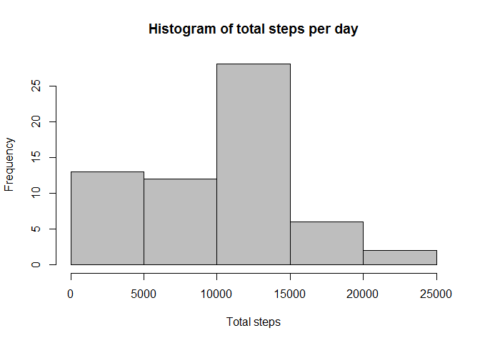
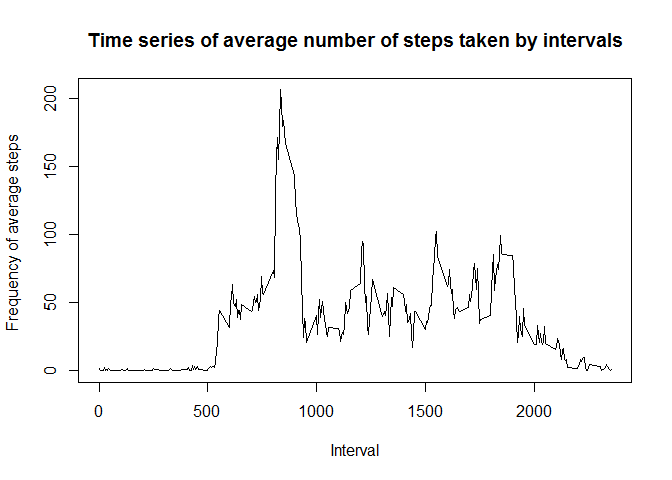
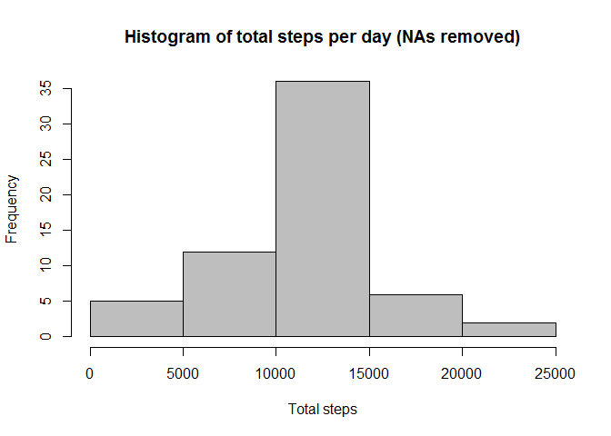
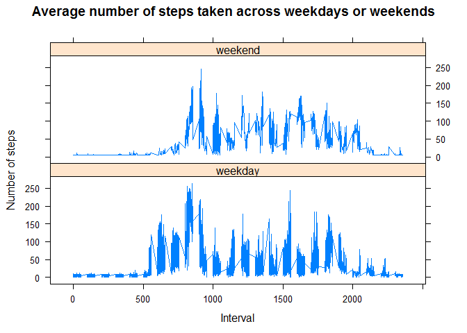

The following analysis are performed using anonymised data collected
during the months of October and November, 2012 that includes the number
of steps taken in 5 minute intervals each day from a personal activity
monitoring device.

Dataset: [Activity monitoring
data](https://d396qusza40orc.cloudfront.net/repdata%2Fdata%2Factivity.zip)

The variables included in this dataset are:

-   steps: Number of steps taking in a 5-minute interval (missing values
    are coded as NA)
-   date: The date on which the measurement was taken in YYYY-MM-DD
    format
-   interval: Identifier for the 5-minute interval in which measurement
    was taken

1 Loading and preprocessing the data
------------------------------------

    #if(!file.exists("data")){dir.create("data")}
    #fileUrl <- "https://d396qusza40orc.cloudfront.net/repdata%2Fdata%2Factivity.zip"
    #download.file(fileUrl,destfile="./data/RepReserchProject1.zip")
    #unzip(zipfile="./data/RepReserchProject1.zip",exdir="./data")
    activity <- read.csv(".\\data\\activity.csv",header = T)
    str(activity)

    ## 'data.frame':    17568 obs. of  3 variables:
    ##  $ steps   : int  NA NA NA NA NA NA NA NA NA NA ...
    ##  $ date    : Factor w/ 61 levels "2012-10-01","2012-10-02",..: 1 1 1 1 1 1 1 1 1 1 ...
    ##  $ interval: int  0 5 10 15 20 25 30 35 40 45 ...

    ## As the date field is a factor variable, we will need to transform this into a date class.
    as.Date(activity$date, "%Y-%m-%d") -> activity$date

2 What is mean total number of steps taken per day?
---------------------------------------------------

For this part of the assignment, you can ignore the missing values in
the dataset.

**Calculate the total number of steps taken per day**

    StepsTotalPerDay <- aggregate(activity$steps, by=list(activity$date), FUN=sum, na.rm=T)
    names(StepsTotalPerDay) <- c("Date", "Total")
    head(StepsTotalPerDay)

    ##         Date Total
    ## 1 2012-10-01     0
    ## 2 2012-10-02   126
    ## 3 2012-10-03 11352
    ## 4 2012-10-04 12116
    ## 5 2012-10-05 13294
    ## 6 2012-10-06 15420

**Make a histogram of the total number of steps taken each day**

    hist(StepsTotalPerDay$Total, col="grey", main="Histogram of total steps per day", xlab="Total steps")

**Calculate and report the mean and median of the total number of steps
taken per day**

    summary(StepsTotalPerDay)

    ##       Date                Total      
    ##  Min.   :2012-10-01   Min.   :    0  
    ##  1st Qu.:2012-10-16   1st Qu.: 6778  
    ##  Median :2012-10-31   Median :10395  
    ##  Mean   :2012-10-31   Mean   : 9354  
    ##  3rd Qu.:2012-11-15   3rd Qu.:12811  
    ##  Max.   :2012-11-30   Max.   :21194

-   Mean and median are 9354 and 10395 respectively for total steps\*

3 What is the average daily activity pattern?
---------------------------------------------

**Make a time series plot (i.e. type = "l") of the 5-minute interval
(x-axis) and the average number of steps taken, averaged across all days
(y-axis)**

    StepAveragesPerInterval <- aggregate(activity$steps, by=list(activity$interval), FUN = mean, na.rm = T)
    names(StepAveragesPerInterval) <- c("Interval", "AverageSteps")
    head(StepAveragesPerInterval)

    ##   Interval AverageSteps
    ## 1        0    1.7169811
    ## 2        5    0.3396226
    ## 3       10    0.1320755
    ## 4       15    0.1509434
    ## 5       20    0.0754717
    ## 6       25    2.0943396

    plot(StepAveragesPerInterval, type="l", main="Time series of average number of steps taken by intervals", xlab="Interval", ylab="Frequency of average steps ")

**Which 5-minute interval, on average across all the days in the
dataset, contains the maximum number of steps?**

    StepAveragesPerInterval[which(StepAveragesPerInterval$AverageSteps == max(StepAveragesPerInterval$AverageSteps)), 1]

    ## [1] 835

*Interval number 835 contains the maximum number of average steps*

Imputing missing values
-----------------------

**Calculate and report the total number of missing values in the dataset
(i.e. the total number of rows with NAs)**

    sum(is.na(activity$steps))

    ## [1] 2304

There are 2304 rows where the steps value are missing.

**Devise a strategy for filling in all of the missing values in the
dataset. The strategy does not need to be sophisticated. For example,
you could use the mean/median for that day, or the mean for that
5-minute interval, etc.**

    # NA indices
    NAIndex <- which(is.na(activity$steps))

    # Create a vector of means
    ImputeValues <- rep(mean(activity$steps, na.rm=TRUE), times=length(NAIndex))

**Modify the dataset with missing values replaced with a mean**

    activity[NAIndex, "steps"] <- ImputeValues
    head(activity)

    ##     steps       date interval
    ## 1 37.3826 2012-10-01        0
    ## 2 37.3826 2012-10-01        5
    ## 3 37.3826 2012-10-01       10
    ## 4 37.3826 2012-10-01       15
    ## 5 37.3826 2012-10-01       20
    ## 6 37.3826 2012-10-01       25

**Make a histogram of the total number of steps taken each day and
Calculate and report the mean and median total number of steps taken per
day. Do these values differ from the estimates from the first part of
the assignment? What is the impact of imputing missing data on the
estimates of the total daily number of steps?**

    StepsTotalPerDay <- aggregate(activity$steps, by=list(activity$date), FUN=sum, na.rm=T)
    names(StepsTotalPerDay) <- c("Date", "Total")
    hist(StepsTotalPerDay$Total, col="grey", main="Histogram of total steps per day (NAs removed)", xlab="Total steps")

    summary(StepsTotalPerDay)

    ##       Date                Total      
    ##  Min.   :2012-10-01   Min.   :   41  
    ##  1st Qu.:2012-10-16   1st Qu.: 9819  
    ##  Median :2012-10-31   Median :10766  
    ##  Mean   :2012-10-31   Mean   :10766  
    ##  3rd Qu.:2012-11-15   3rd Qu.:12811  
    ##  Max.   :2012-11-30   Max.   :21194

Both the mean and median for this modified set are 10,766 which is
higher than previously observed values (Mean a: 9354 and median :10395)

Are there differences in activity patterns between weekdays and weekends?
-------------------------------------------------------------------------

**Create a new factor variable in the dataset with two levels -
"weekday" and "weekend" indicating whether a given date is a weekday or
weekend day**

    # Calculate the weekdays 
    activity <- cbind(activity, day= weekdays(activity$date))
    ## Calculate type of day ( weekend or week day)
    activity  <- cbind(activity, daytype=ifelse(activity$day == "Saturday" | activity$day == "Sunday", "weekend", "weekday"))
    head(activity)

    ##     steps       date interval    day daytype
    ## 1 37.3826 2012-10-01        0 Monday weekday
    ## 2 37.3826 2012-10-01        5 Monday weekday
    ## 3 37.3826 2012-10-01       10 Monday weekday
    ## 4 37.3826 2012-10-01       15 Monday weekday
    ## 5 37.3826 2012-10-01       20 Monday weekday
    ## 6 37.3826 2012-10-01       25 Monday weekday

**Make a panel plot containing a time series plot (i.e. type = "l") of
the 5-minute interval (x-axis) and the average number of steps taken,
averaged across all weekday days or weekend days (y-axis).**

    # Calculate average number of steps taken by daytype, day and interval
    activityPlot <- aggregate(activity$steps, 
                           by=list(activity$daytype,activity$day, activity$interval), FUN = mean)

    names(activityPlot) <- c("daytype", "day", "interval", "mean")
    head(activityPlot)

    ##   daytype      day interval     mean
    ## 1 weekday   Friday        0 8.307244
    ## 2 weekday   Monday        0 9.418355
    ## 3 weekend Saturday        0 4.672825
    ## 4 weekend   Sunday        0 4.672825
    ## 5 weekday Thursday        0 9.375844
    ## 6 weekday  Tuesday        0 0.000000

    library(lattice)

    ## Warning: package 'lattice' was built under R version 3.3.3

    xyplot(mean ~ interval | daytype, activityPlot, type="l", xlab="Interval", ylab="Number of steps",layout=c(1,2),  main="Average number of steps taken across weekdays or weekends")

